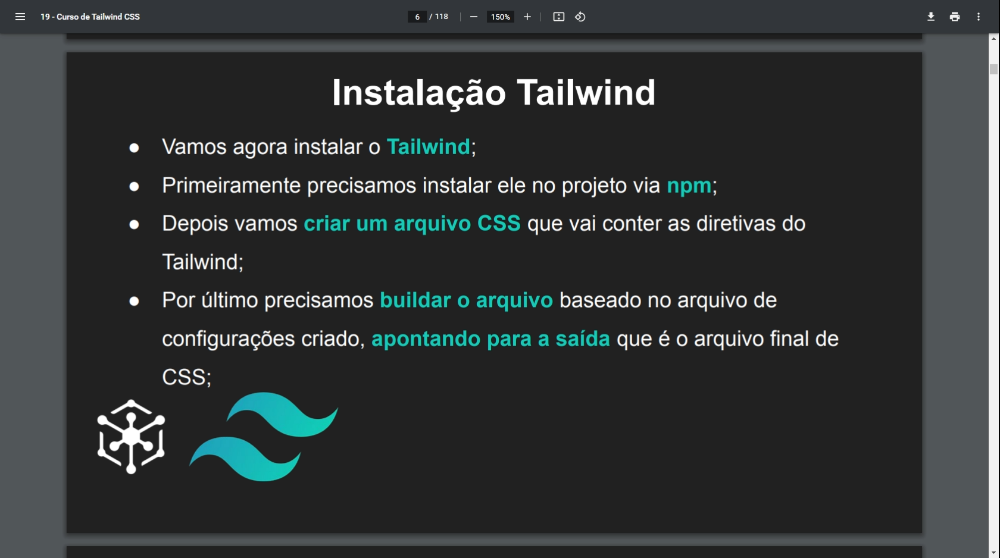

## Instalando e rodando o Tailwind



### Comandos

```sh
npm init -y
```

```sh
npm install -D tailwindcss
```

Colocar no arquivo css os seguintes imports:
<br>
@tailwind base;
<br>
@tailwind components;
<br>
@tailwind utilities;

```sh
npx tailwindcss init (cria o arquivo de configuração tailwind)
```

```sh
npx tailwindcss build styles.css -o src/css/styles.css (compila o arquivo css para o destino especificado)
```